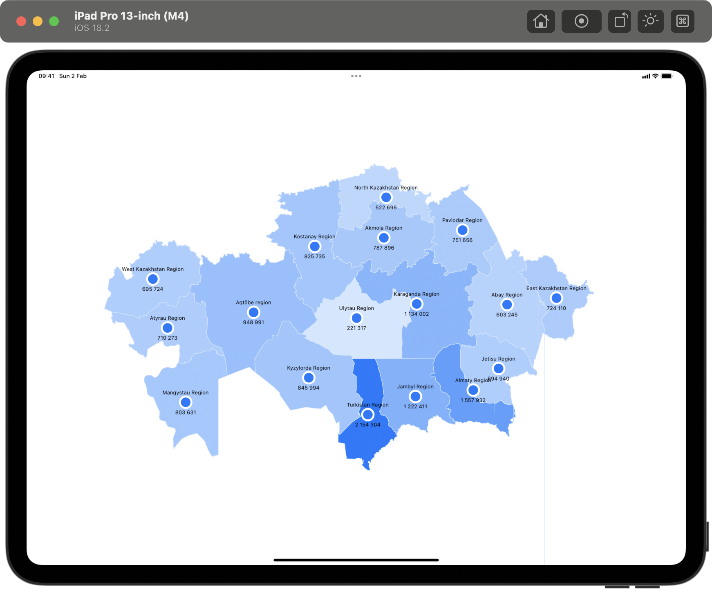

# Kazakhstan Map Example

An example project for [Drawing maps with Swift Charts](https://www.artemnovichkov.com/blog/drawing-maps-with-swift-charts) article.

  

## Author

Artem Novichkov, https://www.artemnovichkov.com/

## License

The project is available under the MIT license. See the [LICENSE](./LICENSE) file for more info.
